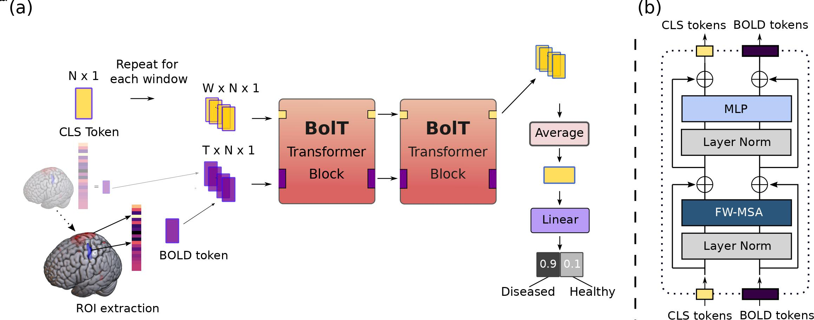
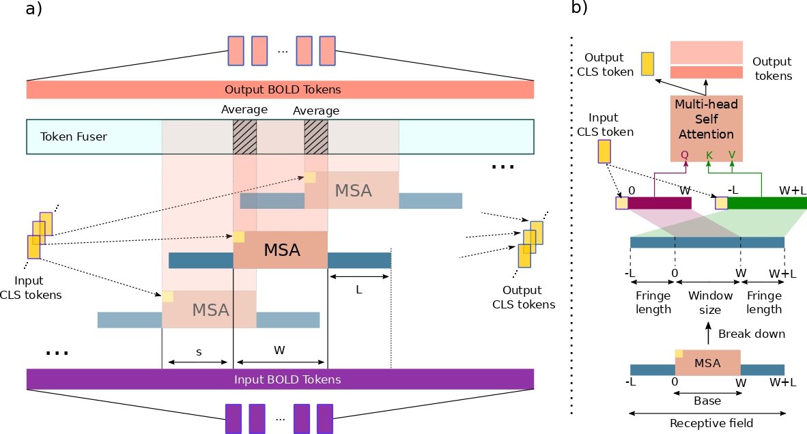

# **BolT**

## *Fused Window Transformers for fMRI Time Series Analysis*

Official PyTorch implementation of BolT described in the [paper](https://arxiv.org/abs/2205.11578).

## Overall View

### Architecture

### FW-MSA : Fused window multi-head self-attention

## Running

### Dependicies

* python >= 3.7
* numpy >= 1.21.4
* torch >= 1.10.1
* torch-cuda >= 10.2
* torchvision >= 0.11.2
* timm >= 0.5.4
* nilearn >= 0.8.1
* tqdm >= 4.62.3
* MRIcroGL >= 1.2
* opencv-python >= 4.5.5

### Dataset
In our work, we used two datasets, ABIDE I and the ADNI (Subset) dataset. We provide a testing environment for both, with a data fetcher script for ABIDE I using the famous nilearn python package. To replicate our results on the ADNI (Subset) dataset, you have to download the ADNI (Subset) dataset from the [ADNI Project](https://adni.loni.usc.edu/data-samples/data-types/mri/).

### Data Prep

Before doing anything, you need to have ROI extracted versions of the downloaded 4D fMRI datasets. We provide the ROI extractor python script for ABIDE I and also the 4D fMRI data fetcher script. Please note that you do not have to use these scripts to reproduce the results of our paper, as long as you link ROI extracted fMRI data to [dataset.py](/Dataset/dataset.py) 

For ABIDE I: 

    python prep.py --dataset abide1

This will both download 4D fMRI data (to "Dataset/Data/Bulk/ABIDE/") and extract ROIs ready to be used by BolT.

## Train and Testing

For training and testing our model run [tester.py](tester.py) file.

    python tester.py --dataset abide1 --model bolT

# Work Distribution

* Abdulaziz Samra (main idea, ADNI preprocessing, dataloaders)
* Oluwafemi Adejumobi (BolT replication, Training with ABIDE-1, Testing with ABIDE-1, making report)
* Koffivi Gbagbe (BolT replication, Training with ABIDE-1, Testing with ABIDE-1, making report)
* Charlene Madida (making report)
* Anton Labutin (making presentation slides)
# Reference
Main Repo => https://github.com/icon-lab/BolT

